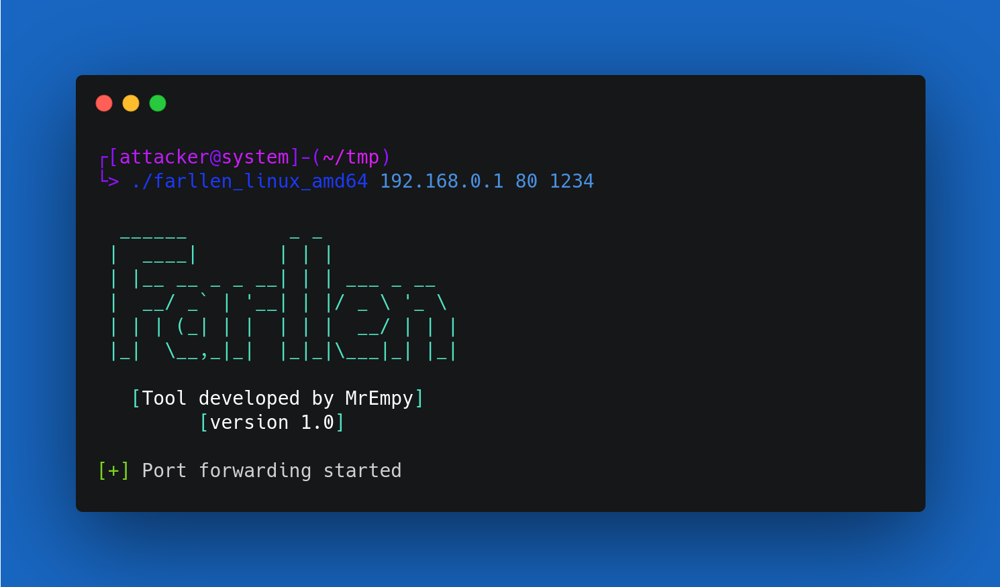
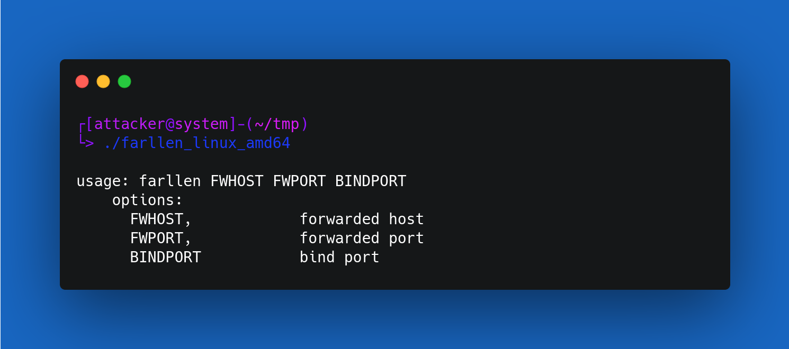

<h1 align="center">「🚪」About Farllen</h1>

<p align="center"></p>

<p align="center">Farllen is a tool developed in C to help Pentesters gain access from internal devices of an infrastructure in a Pentest.</p>

## Help




## Installation

```
$ git clone https://github.com/MrEmpy/Farllen.git
$ cd Farllen
$ make
$ ./farllen <INTERNAL IP> <INTERNAL PORT> <BIND PORT>
```

## Buy me a coffee?


[LivePix](https://livepix.gg/mrempy)
